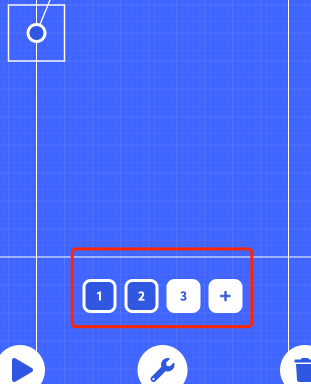
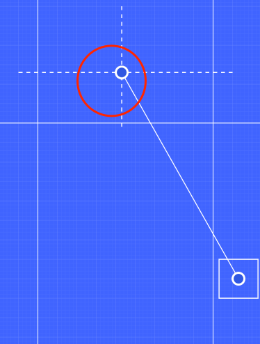

# 基础

### 新增、选择砖块组

在排列砖块模式下，屏幕下方的这个元素我们称它为砖块组选择器，  
点击加号可以新增一个砖块组

点击某个数字，可以选中一个砖块组，重复点击已经选中的砖块组会取消选中  
选中砖块组时点击右下角的删除按钮可以删除一个砖块组

至少要有一个砖块组才能开始关卡测试，系统最多限制在 8 组  
但我们建议最好不要超过 6 组，因为过多的砖块会使关卡通过时间拉得过长，这会导致玩家感到乏味

### 绳索固定点

  
你可以通过拖动红圈中的锚点更改绳索的固定点，虚线标识出的区域是允许的范围  

### 拖动砖块

你可以发现在编辑器中，为了提高易用性和关卡的质量，我们对很多可拖动的元素限定了位置  
但砖块的位置是完全不限制的，关卡设计者需要自行判断位置是否合理。  
比如你不应该把砖块放置到画布底部以下，这会在你的关卡运行时直接判定为失败。  
砖块与画布的距离过大时也可能出现砖块还未出现在画布中关卡就被判定失败。

不限制砖块的位置是因为：作为编辑器的设计者和开发者，我们不能预期关卡创作的可能性  
限制砖块的摆放位置可能影响玩家的创作需求，故砖块不做限位。  

但我们建议您在摆放砖块时：
1. 放置在舞台的左侧和右侧，在生成时保证砖块不在舞台内
2. 确认在关卡实际运行时砖块在舞台中是可见的