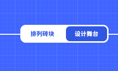

# 物体概述

简单的描述摇摆积木的玩法，就是你需要扔出若干块砖块，并且保证他们不掉落到屏幕外  
所以为了让关卡满足这一需要，你的关卡必须有至少一个砖块，和至少一个物体用来承载砖块使其不掉落到舞台外。

我们的编辑器有两种模式，“排列砖块”和“设计舞台”模式，模式可以在右上角的开关上切换  
切换到“设计舞台”模式开始添加物体到关卡中

添加一个物体之后，你可以通过点击选中它，这时你可以选择修改它的参数或删除  
任何物体都有旋转这个属性，其他的属性都根据物体的性质决定。  
物体分为平台、生活物品、装置，关于不同物体的区别和属性，你可以在对应的页面中查看
