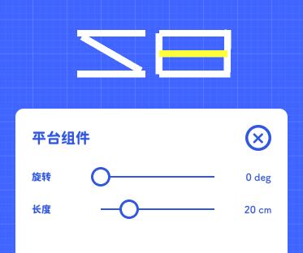

# 平台

如果你不想让你的关卡太复杂，其实只用平台就足够了，甚至说在摇摆积木一代中，物体就只有平台这一种。  
平台是物体中最简单的一种，如同它的名字，平台就是用来承载砖块的。

### 长条平台

长条平台有长度属性，你可以修改他的长度  
如果你玩过《摇摆积木》，你肯定知道:平台组件通过旋转组合构建出一个独特的形状  
甚至说画一幅像素画！发挥你的想象力吧！

### 圆点平台

圆点平台一般多个一起使用，或和其他物体一起使用
他的大小是不可调的，固定 20cm²
