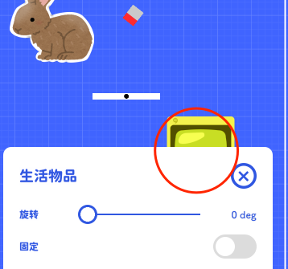
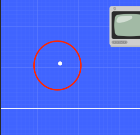
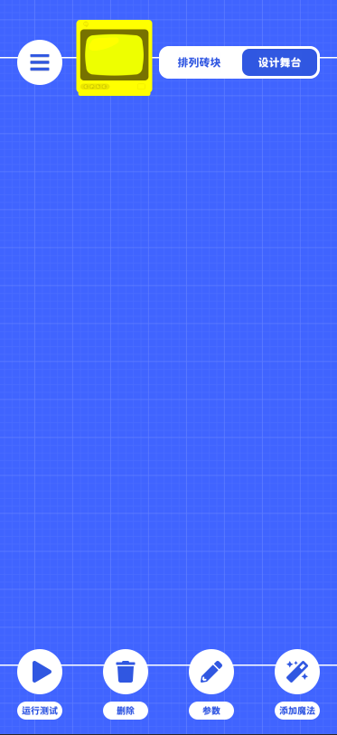

# 觉得很难对物体进行编辑？

这篇文章会讨论一些关卡设计师在使用编辑器过程中可能产生的困惑，我们也会讨论一些 UI 设计的细节。

### 物体被卡片遮挡

> 在有限的空间中放置物体的调整组件非常困难，因为我们在进行参数调整的同时也需要观察物体本身的变化。  
> 所以一些诸如弹窗之类的方案会覆盖整个画面，所以我们需要一个只占用一部分屏幕空间的方案
> 仅有的两种方案是开发一个漂浮的窗口，这在另一款类似的游戏 TrickShot2 中被大量应用  
> 但在物体过大时，或参数过多时，这个方案也出现了很大的问题。尤其是出现 5 个及以上的可操作性项目时  
> 总体来说，这种弹窗呼出的方式并不够直接（通过长按），而且容易导致舞台变得非常混乱
> 另外一种方案是在固定位置弹出一个固定高度的卡片，超出高度的项目可以通过滑动来查看  
> 这个方案解决了画面混乱和不容易呼出的问题。但它与上一方案相比的劣势就是缺少遮挡的判断，  
> 如果你的物体在屏幕中位置靠下，它就必然被卡片遮挡。  
> 不过，另外一个更重要的原因就是因为不存在遮挡判断的问题，这个方案的开发成本更低，运行会更稳定。

如何解决遮挡的问题？  
如果你的物体遮挡，那就拖动画布知道物体出现就可以了。  
默认情况下，拖动画布会取消选中的物体。但我们增加可以了一个锁定，如果参数卡片是显示的，那么拖动画布就不会取消原本物体的选中

### 过小的物体很难选中

> 技术上来说，可以通过给物体增加一个更大的包围盒来使其更容易选中  
> 但这会带来新的问题，有包围盒的物体（边缘）和没有包围盒的物体选中可能出现预期外的结果。  
> 上面这个问题不是一个技术问题，是选择精度和选择体验的差异，目前我们认为精度会更重要，但也有可能在后续版本中做出改变。

如何选中很小的物体？
目前可以双指放大，直到大到能够选中为止。

### 为什么上下的空白区域里不能放值物体

为了让关卡在大多数手机屏幕上都能完整的显示出来，我们把舞台限制在了一个`375*667`的盒子里  
`375*667`是 iPhone6 的分辨率，目前的大部分手机宽高比都大于 iPhone6，所以你会看到上下两块不能放置物体的区域
