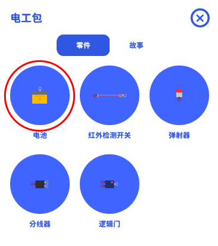
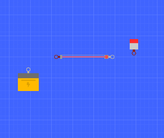
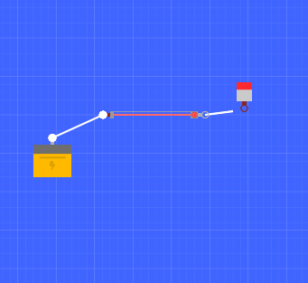

# 电工包(Eunit)

电工包在某种意义上来说算是一种特殊的装置。只是电工包组件有传递和处理电信号的能力。  
这种能力能快速的实现一些非常复杂的关卡逻辑。  
但不宜在关卡中使用过多的电工包组件，这些组件其实抽象掉了很多逻辑细节。也就是说你的关卡里电工包组件越多，你的关卡看起来就越不直观，容易很乱。

虽然电工包在实现上并没有二级分类，但是为了方便理解，我们将电工包分为三种：

- 开关
- 电脑
- 设备

任何电工包组件都可能有 1 个以上的端口，端口分为输入(I)与输出(O)

其中开关一般只有 1 个输入与 1 个输出端口，它的主要人物就是截断信号，在满足一些条件后传递信号。  
电脑可能有多个输入或多个输出，它们可以处理信号，并决定如何传递信号。是最复杂的一种电工组件。  
设备基本是装置的翻版，但他并不会主动工作，设备的启动与关闭都取决于输入端上是否有电力。

此外还有一个特殊的组件：电池，它是一种特殊的开关，在生成后就会立即输出电力。

显然，单一的电工包组件并没有实际意义。  
要使用电工包完成关卡设计，你至少需要三个电工包组件。

首先我们要在舞台中添加一个电池。

然后再添加一个开关和被驱动的弹射器  
这里可以看到不同组件上有不同颜色的端口，红色代表输入端，灰色代表输出端  
在灰色端口上拖拽可以开始接线

松开手时，线会自动连接到最近的输入端口

端口的关系是一对一的，如果你想取消连接，从任意一边的端口上重新拖拽即可。
