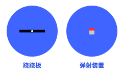
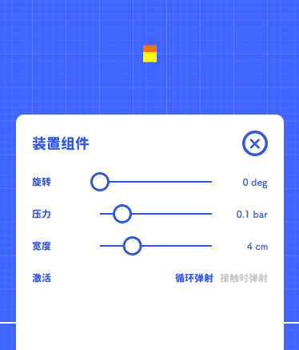

# 装置

装置在概念上是一些简单的机械结构组成的物体  
他和生活物品有一定的相似，但生活物品的特性全部是被动的，必须被撞击后才能体现出来  
而装置的特性有被动的，也有主动的，而且装置大多都提供若干参数可供调节

在最先发布的版本中，我们提供了两个很基本的装置  

用其中的弹射装置来做例子，它就提供了相对丰富的参数  
你可以通过压力调整弹射的力度，宽度决定弹射装置的大小  
也可以通过调整激活条件来决定在何时弹射  

