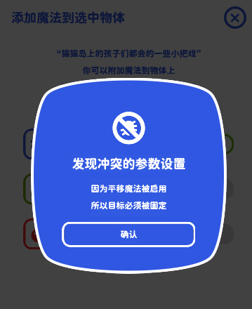
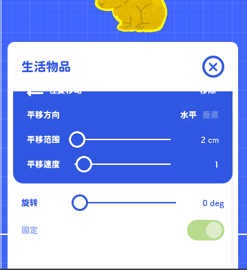

# 魔法

### 基础

我们的物体添加到舞台之后都是默认静止的，  
如果有一种方法可以让物体按照一定的规则往复移动，那么关卡的多样性会进一步提升。

对于魔法最基本的定义：魔法可以应用在任何类型的物体上。  
其实不仅仅是移动，如果某个复杂的操作可以通用在所有物体上，它就被定义为摇摆积木中的魔法。  
所以我们需要先将魔法添加到具体物体上，才能设置魔法运行的规则，这一步骤会稍微有一点繁琐。

1. 先选中一个物体，点击右下角的添加魔法按钮
2. 点击开关即可添加魔法到物体上

3. 关闭魔法列表，打开参数列表，你会看到一个魔法设置面板已经添加到参数中

点击面板右上角的移除会禁用物体的魔法，如果要重新打开，需要在魔法列表面板中重新添加

### 参数冲突

一些看起来简单的魔法可能会与物体的属性产生冲突。  
想象这样一种情况：一个生活物品的“固定”属性关闭时，它应该在舞台中自然坠落  
但平移魔法需要物体是不是重力影响的。

那么如果要在生活物品上应用平移魔法，生活物品的固定属性应该是固定开启的。

当你添加了一个与物体冲突的魔法，参数会被自动设置为与魔法兼容的设置，游戏会在发现冲突时通过窗口提示你。  

此时可以发现冲突的参数已被禁用，直到关闭引起冲突的魔法之前，你都不能调整那个参数

目前这种冲突只发生在生活物品与平移魔法、旋转魔法中。如果后续新增魔法，也可能有其他情况的冲突
