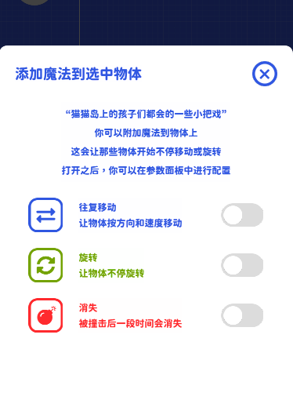
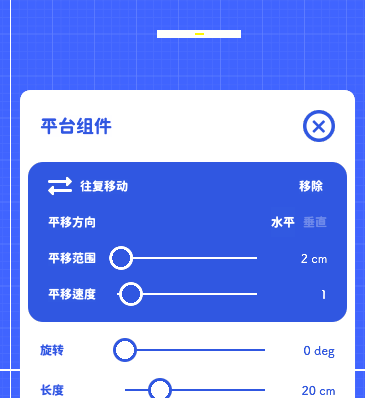

# 魔法

### 基础

我们的物体添加到舞台之后都是默认静止的，  
如果有一种方法可以让物体按照一定的规则往复移动，那么关卡的多样性会进一步提升。

对于魔法最基本的定义：魔法可以应用在任何类型的物体上。  
其实不仅仅是移动，如果某个复杂的操作可以通用在所有物体上，它就被定义为摇摆积木中的魔法。  
所以我们需要先将魔法添加到具体物体上，才能设置魔法运行的规则，这一步骤会稍微有一点繁琐。

1. 先选中一个物体，点击右下角的添加魔法按钮
2. 点击开关即可添加魔法到物体上

3. 关闭魔法列表，打开参数列表，你会看到一个魔法设置面板已经添加到参数中

点击面板右上角的移除会禁用物体的魔法，如果要重新打开，需要在魔法列表面板中重新添加
