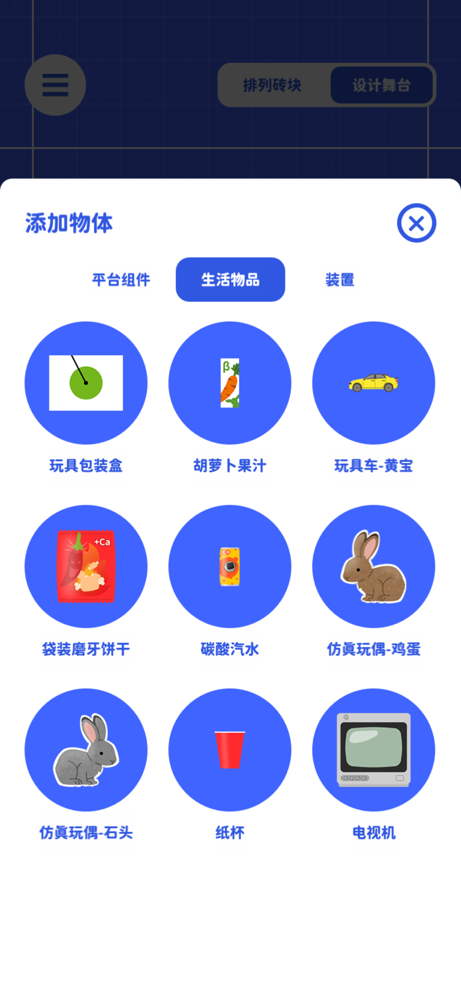
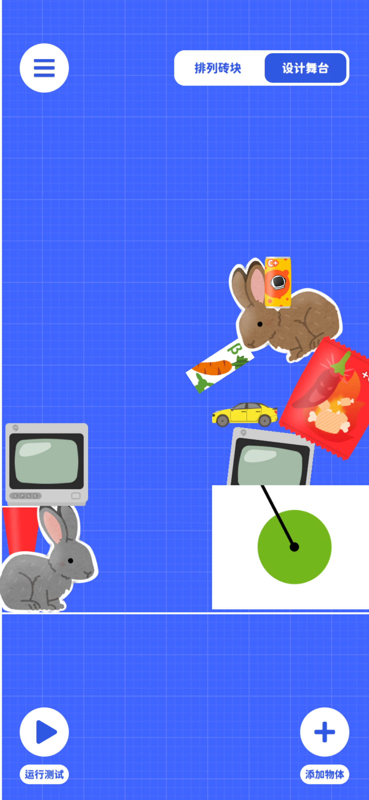

# 生活物品

生活物品在概念上是一系列拟真的物体，他们被设定为猫猫岛上的孩子们生活中的用到物体。  
最初，我们只是认为黑与白的形状会让关卡变得非常单调，这些细节更丰富的物体会让关卡具有更多的细节。  

后来我们试着不仅仅让他们有这些物品具有拟真的外形，还有拟真的特性！  
用例子来说明，如果你添加了一台电视机，那么电视机就真的会显示舞台的实时画面  
如果你添加一台玩具车，玩具车被撞击后就会开始行驶。
这给关卡创造了更多的不确定性。

另外，你会发现生活物品的参数都有一个**固定**属性。  
当你打开固定属性时，生活物品会表现的更像一个平台，固定在舞台中某一位置。  
甚至你其实可以完全用生活物品代替砖块，这会让关卡的画面变得非常丰富

当你关闭固定属性，生活物品会收到引力的影响，自然的在舞台中坠落  
要知道摇摆积木的关卡失败判定条件是任何物体掉落到屏幕外  
这时生活物品可以看成一种预先设置的障碍物、一种设计过的陷阱  
拿上面的玩具车举例子，如果玩具车收到砖块撞击，它就会开始狂奔，飞到舞台外导致关卡失败
